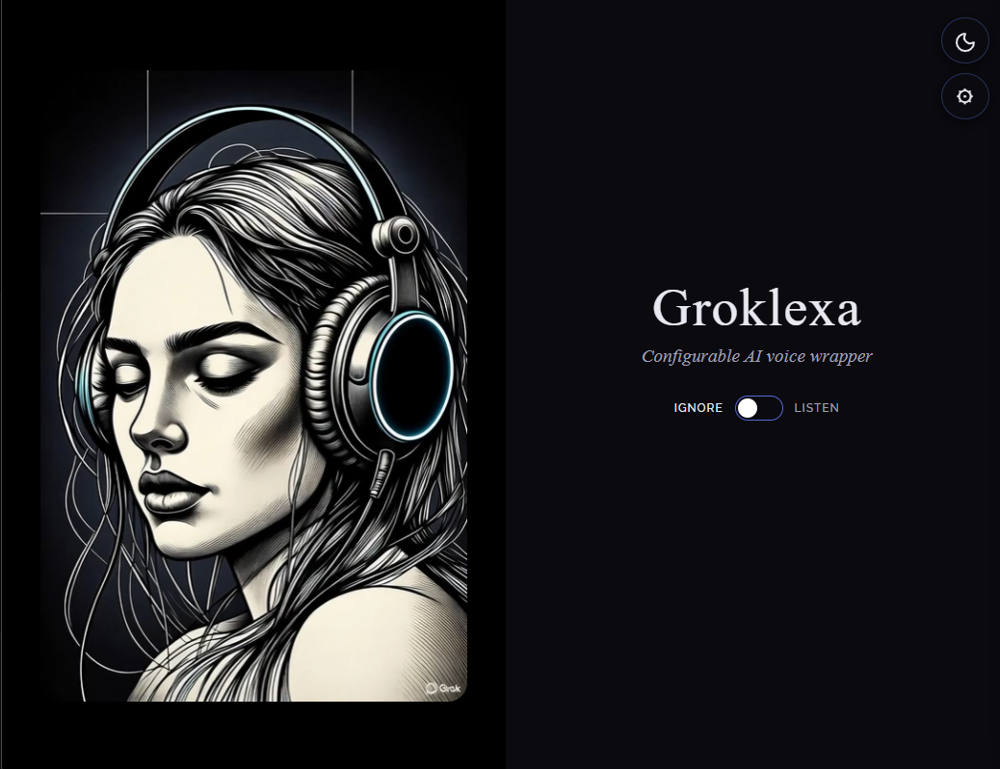
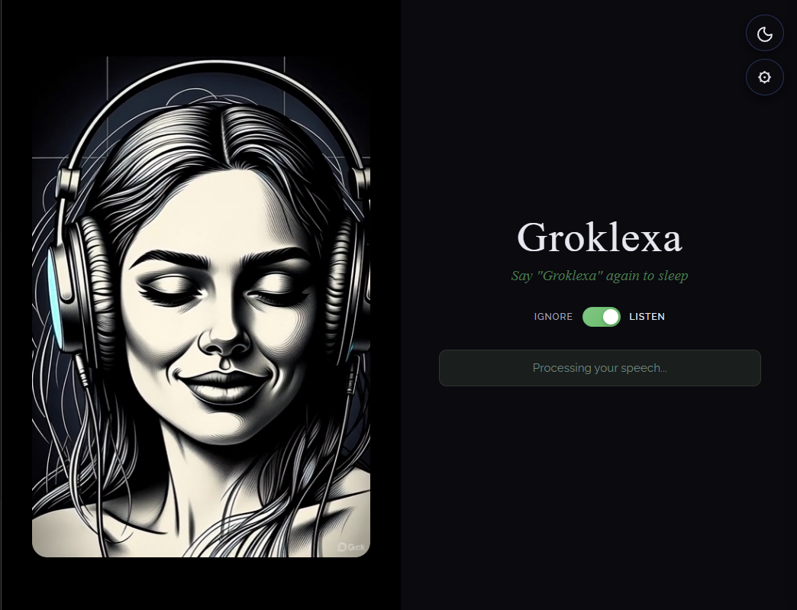

# Groklexa

A grok (and local AI) friendly hands free web app for voice interactions with AI

Groklexa is a fully in-browser voice assistant that wakes up when you say its custom wake word ("Groklexa" or whatever you choose), letting you chat hands-free with Grok without ever pressing a button.

## Features

* 🎤 **Custom wake-word detection** running client-side as a 2MB voice model in the browser (powered by OpenWakeWord)
* 🎯 **Voice activity detection (VAD)** - Neural network-based (Silero) for reliable start/stop
* 🔊 **Real-time speech-to-text → Grok inference → text-to-speech pipeline**
* 🎬 **Animated visual feedback** - A serene woman in headphones "wakes up" (head turn + subtle smile) when listening, drifts back to sleep when off
* 📋 **Threaded conversation history** with copy, download, and manual clear
* ⚙️ **All processing configurable** - Transcription, inference, and synthesis can all be configured to be remote cloud or local
* 🔒 **100% client-side wake word and VAD** → no audio leaves your device until you speak after activation
* 🌙 **Day/Night modes** - Elegant UI with theme switching

Perfect for desktop always-on setups, kitchen counters, workshops, or just late-night philosophical rants when typing feels like too much work. Open source, hackable, and deliberately fun.

### Ignore Mode
*Waiting for you to enable listening*



### Listening Mode
*Say "Groklexa" to wake - she opens her eyes and listens*



### Settings Panel
*Configure voice, APIs, view conversation history*


## Quick Start

### Prerequisites

- Python >= 3.11
- [uv](https://github.com/astral-sh/uv) for dependency management
- XAI API key (for default configuration)

### Installation

```bash
# Clone and install dependencies
git clone https://github.com/ixmon/groklexa.git
cd groklexa
uv sync
```

### Setup

Set your XAI API key:

```bash
export XAI_API_KEY="your-api-key-here"
```

### Run

```bash
uv run python web_app.py
```

Open https://localhost:5001 in your browser.

## Usage

1. Click "Listen" toggle to enable wake word detection
2. Say "Groklexa" to activate conversation mode
3. Speak naturally - VAD detects when you're talking
4. Say "Groklexa" again to return to sleep mode

## HTTPS for Local Network

To access from other devices on your local network (required for microphone):

1. **Generate SSL certificate:**
   ```bash
   ./tools/generate_cert.sh
   ```

2. **Start server and access via HTTPS**

3. **Accept the self-signed certificate in your browser**

## Configuration

Open the settings panel (gear icon) to configure:

- **Voice selection** - Choose from Ara, Rex, Sal, Eve, Leo
- **API configuration** - Single unified API or separate APIs for transcription, inference, and synthesis
- **Manual VAD** - Toggle volume-based VAD for testing

Configuration is saved to `config/api_settings.json` (gitignored).

## Local Models (Ollama)

For fully local inference, Groklexa supports [Ollama](https://ollama.ai). Install Ollama, then pull a model:

```bash
# Recommended: dolphin-llama3:8b - uncensored, great conversational quality
ollama pull dolphin-llama3:8b

# Alternatives
ollama pull mistral:7b        # Fast, good quality
ollama pull llama3.2:3b       # Smallest, fastest (limited capabilities)
```

**Recommended model: `dolphin-llama3:8b`** - Best balance of speed, quality, and conversational ability for local inference. Requires ~6GB VRAM.

> **Note:** Tool calling (search, datetime) is disabled for Ollama models as most local models don't handle function calling reliably. The model will respond conversationally without external tool access.

## Project Structure

```
groklexa/
├── groklexa/
│   ├── __init__.py
│   └── xai_voice_websocket.py    # WebSocket wrapper for XAI API
├── templates/
│   └── index.html                 # Web interface
├── static/
│   ├── openwakeword/             # Wake word models
│   │   └── models/               # ONNX models (melspec, embedding, VAD, groklexa)
│   └── videos/                   # UI animations
├── config/
│   └── api_settings.json         # API configuration (gitignored)
├── docs/                         # Documentation
├── web_app.py                    # Flask web server
├── pyproject.toml                # Project configuration
└── README.md
```

## Python API

```python
import asyncio
from groklexa import XAIVoiceWebSocketWrapper

async def main():
    async with XAIVoiceWebSocketWrapper(voice="Ara") as ws:
        result = await ws.send_audio("path/to/audio.wav")
        print(result['transcription'])
        print(result['ai_response_text'])
        # result['ai_response_audio'] contains PCM16 audio bytes

asyncio.run(main())
```

## Technology

- **XAI Realtime API** - Unified transcription, inference, and synthesis via WebSocket
- **OpenWakeWord** - Browser-based wake word detection with ONNX Runtime Web
- **Silero VAD** - Neural network voice activity detection
- **Flask** - Python web server
- **Web Audio API** - Real-time audio processing

## Future Plans

- [ ] Command-line interface
- [ ] Mobile app (iOS/Android)
- [ ] Custom wake word training
- [ ] Multi-provider cascading (fallback to local when offline)

## License

MIT
